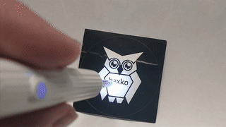

# NE3-Scope
   
A Python based open source viewer for the natfire NE3/NE7 earpick wireless endoscope/otoscope.

## Installation in virtual environment

To avoid problems due to broken or outdated system packages you can consider using a virtual environment:

```
cd /path/to/your/folder
git clone https://github.com/haxko/NE3-Scope.git
cd NE3-Scope
python -m venv .
. bin/activate
./client.py --help
```

## Usage
1. Turn on your earpick
1. Connect your PC to the earpicks WiFi (hndec-xxxx)
   1. You should get 192.168.169.2 as IP via the earpicks DHCP-server
1. Start the software: `./client.py -v -r` (`-v` for verbose, `-r` for auto rotation)
1. Once connected you should see the earpicks image, rotated to stay level (`-r`)

## Notes

- The earpick is fixed to 2.4GHz WiFi channel 1. Try to keep your other networks to channel >= 3 to avoid interference.
- Only a single PC/phone may be connected to the earpick.
- Native resolution is 640x360
- It usually comes in white and black and there are at least 3 different housings
- We also took some images of the internal chips you find them in [/images/hardware/](/images/hardware/)

## Thanks

Reverse engineering and coding was part of a collaboration at the hacker space **haxko e.V.**. If this is helpful to you consider donating to our space to keep lights on: IBAN: DE93 5705 0120 0000 2809 74
